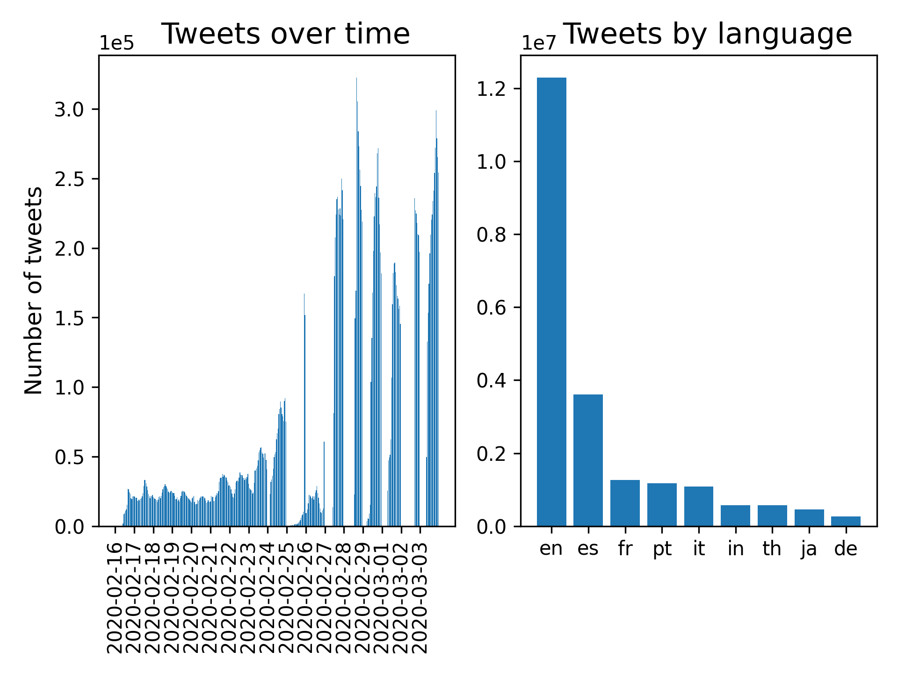

# Corona Twitter Dataset 
We collected Twitter data from the beginning of the COVID-19-outbreak in europe between 16 February and 03 March 2020.

The dataset can be downloaded [here]().  
A [Twitter developer account](https://developer.twitter.com/en/apply-for-access "Click here if you want to apply for a 
developer account") is required to hydrate the tweet IDs. This can e.g. be done with 
[twarc](https://github.com/DocNow/twarc "Click here for the twarc documentation").

For this dataset we have downloaded 22376075 tweets in 64 languages from 16 February until 03 March 2020. 
The keywords we used were CORONA, CORONAVIRUS and #COVID-19. Please note that tweets that have been
deleted in the meantime can't be hydrated.

Keywords | Dates | Gaps
--- | --- | ---
***#COVID-19*** | 16-26 February 2020 | None
***CORONA, CORONAVIRUS*** | 16-23 February 2020 | None
***CORONA, CORONAVIRUS*** |24 February 2020 | 0h-3:18h
***CORONA, CORONAVIRUS*** |25 February 2020 | 0h-21:59h
***CORONA, CORONAVIRUS*** |26 February 2020 | 0h-23:47h
***CORONA, CORONAVIRUS,*** ***#COVID-19*** | 27 February 2020 | 0h-10:30h
***CORONA, CORONAVIRUS,*** ***#COVID-19*** | 28 February 2020 | 0h-13:10h
***CORONA, CORONAVIRUS,*** ***#COVID-19*** | 29 February 2020 | 0h-5:26h
***CORONA, CORONAVIRUS,*** ***#COVID-19*** | 01 March 2020 | 0h-7:07h
***CORONA, CORONAVIRUS,*** ***#COVID-19*** | 02 March 2020 | 0h-17:01h
***CORONA, CORONAVIRUS,*** ***#COVID-19*** | 03 March 2020 | 0h-8:17h

Below you see the number of tweets over time (per hour) and also for the 9 most frequent languages.

